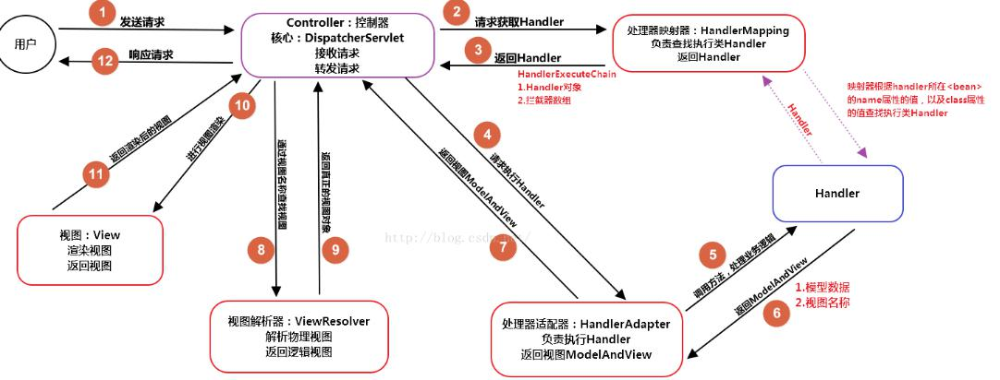

# Spring 入门学习
## 目录

#### 1.\<context:annotation-config/\>
它的作用是隐式的向Spring容器注册
-AutowiredAnnotationBeanPostProcessor,
-CommonAnnotationBeanPostProcessor,
-PersistenceAnnotationBeanPostProcessor,
RequiredAnnotationBeanPostProcessor
这4个BeanPostProcessor.注册这4个bean处理器主要的作用是为了你的系统能够识别相应的注解.
出处 : [参考文章](http://www.cnblogs.com/lcngu/p/5080702.html "参考")

#### 2.\<context:component-scan\> 
如果配置了\<context:component-scan\>那么\<context:annotation-config/\>标签就可以不用再xml中配置了，因为前者包含了后者。另外<context:component-scan>还提供了两个子标签
```xml
<context:include-filter>
<context:exclude-filter>
```
>指定的include-filter没有起到作用，只要把use-default-filter设置成false就可以了。这样就可以避免在base-packeage配置多个包名这种不是很优雅的方法来解决这个问题了

#### 3.\<mvc:annotation-driven /\>
它会自动注DefaultAnnotationHandlerMappi和 AnnotationMethodHandlerAdapter
>结论：在spring-servlet.xml中只需要扫描所有带@Controller注解的类，在applicationContext中可以扫描所有其他带有注解的类（也可以过滤掉带@Controller注解的类）。

#### 4.Spring监听类
>org.srpingframework.web.context.ContextLoaderListener 
该监听器实现了ServletContextListener接口，可以在Web容器启动的时候初始化Spring容器。
* web.xml配置
- \<!-- 配置环境参数,指定Spring配置文件的位置 --\>
```xml
<context-param> 
<param-name>contextConfigLocation</param-name> 
<param-value>/WEB-INF/Spring-*.xml</param-value> 
</context-param>
<!-- 配置Spring的ContextLoaderListener监听器,初始化Spring容器 -->
<listener> 
<listener-class>org.springframework.web.context.ContextLoaderListener</listener-class> 
</listener>
```
其中,contextConfigLocation参数用来指定Spring配置文件的路径.可以写文件全名,也可以使用"星号"通配符来加载多个spring的配置文件.
>注意：如果没有指定 contextConfigLocation 参数,ContextLoaderListener默认会查找/WEB-INF/applicationContext.xml.换句话说,如果我们将Spring 的配置文件命名为applicationContext.xml并放在WEB-INF目录下,即使不指定
contextConfigLocation参数,也能实现配置文件的加载.
contextConfigLocation是ContextLoaderListener类的属性.

#### 5.视图解析器配置前缀和后缀

>如果配置了前缀和后缀,我们的TestController这个Handler中的modelAndView.setViewName("/WEB-INF/jsp/test.jsp");改为modelAndView.setViewName("test")

#### >6.spring MVC
* Spring MVC 虽然说是与Spring 无缝集成 但是配置还是单独分开的 ，也就有了之后的父子容器一说。先说下spring 的流程如图：

  * 1.用户发起请求到前端控制器(DispatcherServler),前端控制器负责接收用户请求与响应.
  * 2.前端控制器调用HandlerMapping(处理器映射器),找到URL所对应的Handler.并返回一个HandlerExecuteChain对象.其中包含有拦截器链与URL对应的Handler.
也就是说HandlerMapping主要是帮我们查找要Handler,并返回一个HandlerExecutChain对象.
  * 3.DispatcherServler(前端控制器)调用,HandlerAdapter(处理器适配器)来执行Handler并返回ModelAndView给HandlerAdapter,然后HandlerAdapter再将ModelAndView返回给DispatcherServler(前端控制器).
  * 4.DispatcherServler调用ViewResolver(视图解析器),将逻辑视图解析成物理视图并返回View对象.
例如我们ModelAndView中存放的视图名为"user"(逻辑视图),通过ViewResolver(视图解析器),解析为"/WEB-INF/user.jsp"(物理视图).
  * 5.前端控制器进行视图渲染,将模型数据填充到Request 域中.
  * 6.前端控制器向用户响应结果.
	>6.1 Spring MVC前端控制器配置
	```xml
	<servlet>
		<servlet-name>springMVC</servlet-name>
		<servlet-class>org.springframework.web.servlet.DispatcherServlet</servlet-class>
		<init-param>
			<param-name>contextConfigLocation</param-name>
			<param-value>classpath*:spring/spring-mvc.xml</param-value>
		</init-param>
		<load-on-startup>1</load-on-startup>
	</servlet>
	<servlet-mapping>
		<servlet-name>springMVC</servlet-name>
		<url-pattern>/</url-pattern>
	</servlet-mapping>
	```
	>如果不配置contextConfigLocation默认加载的是/WEB-INF/servlet名称-servlet.xml.例如:springMvc-servlet.xml.
	* url-pattern配置有三种:
	* 1.*.do 访问以.do结尾的由DispatcherServlet进行解析.
	* 2./(斜杠) 所有访问的地址都由DispatcherServlet进行解析,对于静态的文件解析需要配置,不让DispatcherServlet进行解析.
	>>>>注意:使用此种方式可以实现 RESTful风格的url.
	3./* 这样配置不对,使用这种配置,最终要转发到一个jsp页面时,仍然会由DispatcherServlet进行解析,但是不能根据这个jsp页面找 到handler所以会报错.
	
  >6.2 Spring-DispatcherServler源码分析
- 通过前端控制器源码分析Spring mvc执行过程.

- 第一步:前端控制器接收请求,会调用doDispatch方法.

```java
protected void doDispatch(HttpServletRequest request, HttpServletResponse response) throws Exception {
		HttpServletRequest processedRequest = request;
		HandlerExecutionChain mappedHandler = null;
		boolean multipartRequestParsed = false;
		WebAsyncManager asyncManager = WebAsyncUtils.getAsyncManager(request);
		try {
			ModelAndView mv = null;
			Exception dispatchException = null;
			try {
				processedRequest = checkMultipart(request);
				multipartRequestParsed = (processedRequest != request);
				// Determine handler for the current request.
				mappedHandler = getHandler(processedRequest);
				if (mappedHandler == null || mappedHandler.getHandler() == null) {
					noHandlerFound(processedRequest, response);
					return;
				}
				// Determine handler adapter for the current request.
				HandlerAdapter ha = getHandlerAdapter(mappedHandler.getHandler());
				// Process last-modified header, if supported by the handler.
				String method = request.getMethod();
				boolean isGet = "GET".equals(method);
				if (isGet || "HEAD".equals(method)) {
					long lastModified = ha.getLastModified(request, mappedHandler.getHandler());
					if (logger.isDebugEnabled()) {
						logger.debug("Last-Modified value for [" + getRequestUri(request) + "] is: " + lastModified);
					}
					if (new ServletWebRequest(request, response).checkNotModified(lastModified) && isGet) {
						return;
					}
				}
				if (!mappedHandler.applyPreHandle(processedRequest, response)) {
					return;
				}
				// Actually invoke the handler.
				mv = ha.handle(processedRequest, response, mappedHandler.getHandler());
				if (asyncManager.isConcurrentHandlingStarted()) {
					return;
				}
				applyDefaultViewName(processedRequest, mv);
				mappedHandler.applyPostHandle(processedRequest, response, mv);
			}
			catch (Exception ex) {
				dispatchException = ex;
			}
			processDispatchResult(processedRequest, response, mappedHandler, mv, dispatchException);
		}
		catch (Exception ex) {
			triggerAfterCompletion(processedRequest, response, mappedHandler, ex);
		}
		catch (Error err) {
			triggerAfterCompletionWithError(processedRequest, response, mappedHandler, err);
		}
		finally {
			if (asyncManager.isConcurrentHandlingStarted()) {
				// Instead of postHandle and afterCompletion
				if (mappedHandler != null) {
					mappedHandler.applyAfterConcurrentHandlingStarted(processedRequest, response);
				}
			}
			else {
				// Clean up any resources used by a multipart request.
				if (multipartRequestParsed) {
					cleanupMultipart(processedRequest);
				}
			}
		}
	}
```
- 第二步:前端控制器调用处理器映射器,来查找Handler
```java
//Determine handler for the current request.
mappedHandler = getHandler(processedRequest);
if (mappedHandler == null || mappedHandler.getHandler() == null) {
	noHandlerFound(processedRequest, response);
		return;
	}
```
- 调用这个方法来返回一个HandlerExecutionChain对象,我们继续跟踪源码发现最后执的是：AbstractHandlerMapping类中的方法

```java
	@Override
	public final HandlerExecutionChain getHandler(HttpServletRequest request) throws Exception {
		Object handler = getHandlerInternal(request);
		if (handler == null) {
			handler = getDefaultHandler();
		}
		if (handler == null) {
			return null;
		}
		// Bean name or resolved handler?
		if (handler instanceof String) {
			String handlerName = (String) handler;
			handler = getApplicationContext().getBean(handlerName);
		}
		HandlerExecutionChain executionChain = getHandlerExecutionChain(handler, request);
		if (CorsUtils.isCorsRequest(request)) {
			CorsConfiguration globalConfig = this.corsConfigSource.getCorsConfiguration(request);
			CorsConfiguration handlerConfig = getCorsConfiguration(handler, request);
			CorsConfiguration config = (globalConfig != null ? globalConfig.combine(handlerConfig) : handlerConfig);
			executionChain = getCorsHandlerExecutionChain(request, executionChain, config);
		}
		return executionChain;
	}
```
* 返回 HandlerExecutionChain 后
* 第三步:调用处理器适配器执行Handler,并返回ModelAndView
```java
// Actually invoke the handler.
   mv = ha.handle(processedRequest, response, mappedHandler.getHandler());

```


