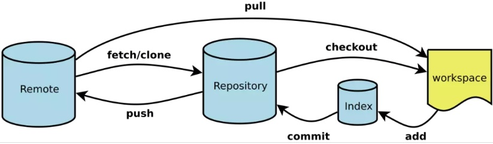

#Git 学习笔记

## 目录
#### 概念



- master: 默认开发分支                
- origin: 默认远程版本库                   
- Index / Stage：暂存区                 
- Workspace：工作区                 
- Repository：仓库区（或本地仓库）                 
- Remote：远程仓库       


#### 命令
在当前目录新建一个git代码仓库： `git init`                    

新建一个目录，将其初始化为git代码仓库： `git init [project-name]`             

下载一个项目和他的整个代码历史： `git clone [url]

#### 配置                
显示当前git配置: `git config --list`                  

编辑git配置文件： `git config -e [--global]`                   

设置提交代码时候的用户信息：  
```
git config [--global] user.name "[name]"     
git config [--global] user.emial "[emial address]"                        
```
#### 增加/删除/修改文件       
添加指定文件到本地缓存区： `git add [file1] [file2] ...`

添加指定文件目录到本地缓存区，包含子目录： `git add [dir]`   

添加当前目录的所有文件到本地缓存区： `gti add .`

添加每个变化文件前，都会要求确认。对同一个文件的多处变化，可以实现分次提交： `git add -p`             

删除工作区文件，并且将这次删除放入本地缓存区： `git rm [file1] [file2] ...` 

停止追踪指定文件，但是该文件会保留在工作区: `git rm --cached [file]`

更改文件，并且将这个改名放入本地缓存区： `git mv [file-originame] [file-newname]`

#### 查看信息
查看有变更的文件： `git status`

显示当前分支的所有历史版本： `git log`

显示commit历史，以及每次commit发生变更的文件： `git log --stat`

搜索提交历史， 根据关键词： `git log -S [keyword]`

显示某个commit之后的所有变动，每个commit占据一行： `git log [tag] HEAD --pretty=format:%s`

显示某个commit之后的所有变动，其“提交说明”必须符合搜索条件： `git log [tag] HEAD --grep feature`

显示某次提交时候，某个文件的内容： `git show [commit]:[filename]`

显示当然分支的最近几次提交： `git reflog`

显示所有提交过的用户， 按提交次数排序： `git shortlog -sn`

#### 远程库
下载远程仓库的所有变动： `git fetch [remote]`

取回远程仓库的变化，并与本地分支合并： `git pull [remote] [branch]`

显示所有远程仓库： `git remote -v`

显示某个远程仓库的信息： `git remote show [remote]`

添加一个新的远程仓库，并命名： `git remote add [shortname] [url]`

上传本地指定分支到远程仓库： `git push [remote] [branch]`

强行推送当前分支到远程仓库，即便是有冲突： `git push [remote] --force`               

推送所有分支到远程仓库: `git push [remote] --all`


#### 版本回退
撤销工作目录中所有未提交的文件的修改内容： `git reset --head HEAD`

可以丢弃工作区的修改,把文件在工作区做的修改全部撤销：`git checkout -- readme.txt`
有2种情况：1.readme.txt自动修改后，还没有放到暂存区，使用 撤销修改就回到和版本库一模一样的状态。
		2.另外一种是readme.txt已经放入暂存区了，接着又作了修改，撤销修改就回到添加暂存区后的状态。
撤销指定的未提交文件的修改内容： `git checkout HEAD <file>`
命令git checkout -- readme.txt 中的 -- 很重要，如果没有 -- 的话，那么命令变成创建分支了。

撤销指定的提交： `git revert <commit>`

退回到之前1天的版本： `git log --before="1 days"`

恢复暂存区的指定文件到工作区： `git checkout [file]`

恢复某个commit的文件到暂存区和工作区： `git checkout [commit] [file]`

恢复暂存区的所有文件到工作区： `git checkout .`

重置暂存区的指定文件，与上一次commit保持一致，但是工作区不变： `git reset [file]`

重置暂存区与工作区，与上一次commit保持一致： `git reset --hard`

重置当前分支的指针为commit，同事重置暂存区，但是工作区不变： `git rest [commit]`

重置当前分支的HEAD为指定commit, 同事重置暂存区和工作去，与指定commit一致： `git rest --hard [commit]`

重置当前HEAD为指定commit, 但保持暂存区和工作区不变： `git rest --keep [commit]`


	
